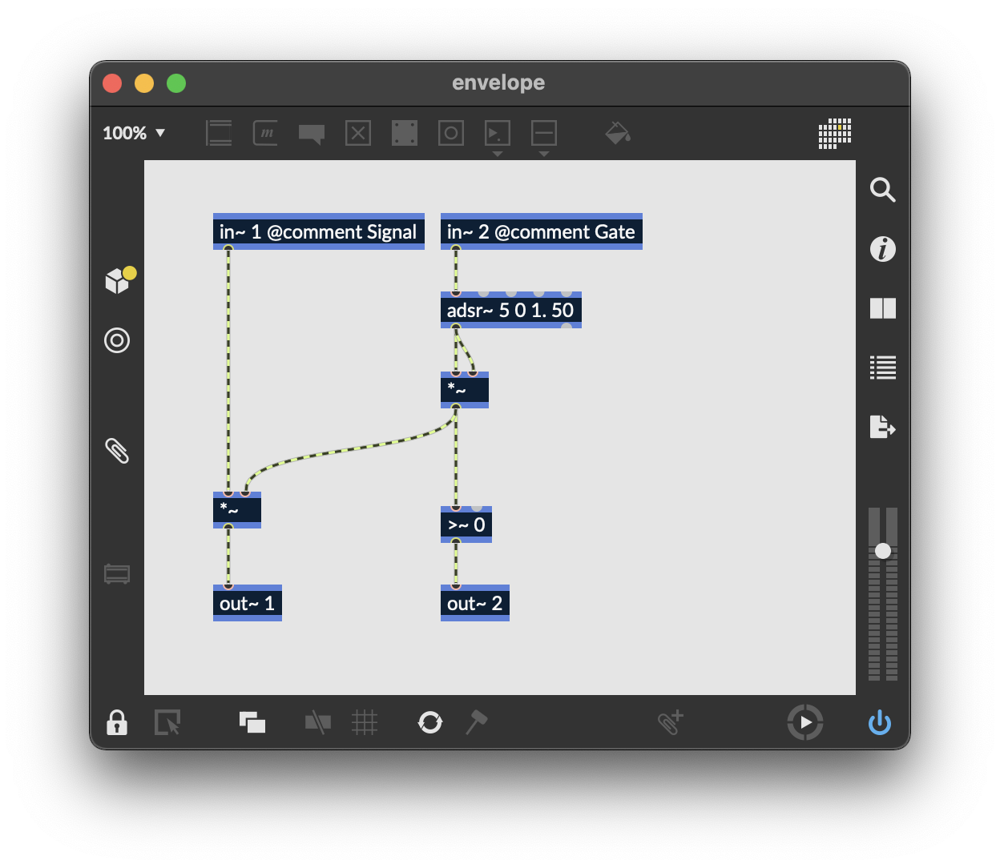
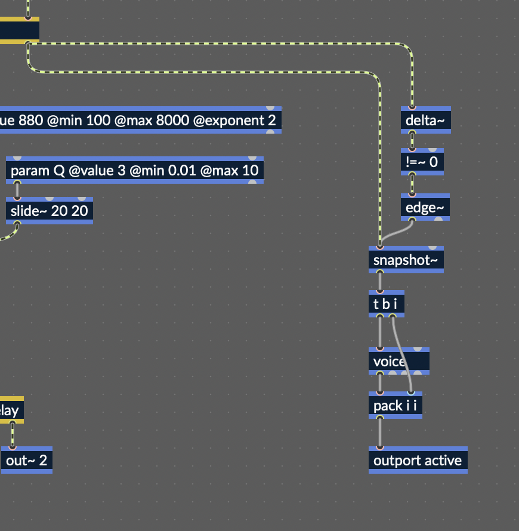

# rnbo-custom-vst

Here we're going to look at how to use RNBO to build a JUCE-based VST,
with a custom UI. We'll be looking specifically at how to create 
interface elements that bind to specific RNBO parameters, and how
to get and set parameters.

## Prerequisites

You're gonna need git.

## Directions

First thing to do is to clone the repo at github.com/cycling74/rnbo.example.juce.
This has the basic framework for building both a standalone JUCE app
as well as a plugin. It's also got a git submodule set up to handle downloading
JUCE as a git submodule. The important thing here though is that you can't just
download it as a zip, you actually have to clone the repo. The repo recommends
actually creating a new repo, using this one as a template. This isn't strictly
necessary, but you can't just download it as a .zip file because then you won't
have any access to submodules. 

Once you've got the repo cloned, you can get the JUCE submodule.

```
git submodule update --init --recursive --progress
```

Alright, now you're ready for the slightly annoying process needed in order to
use a custom UI. First, take the RNBO Intro patch and export it into the folder
called `export` in the JUCE template (you can also use the pre-exported files
in this `rnbo-custom-vst/export`). You'll notice that this contains a folder
`rnbo/adapters/juce`. Important stuff is in here. This is basically the bridge 
between JUCE and your exported RNBO patch. In order to make a custom VST, we'll
be overwriting these files. 

1. First of all, we're going to be making a plugin and not a standalone, so
we can modify our CMake file to reflect this. In `CMakeLists.txt`, find this line:

```
# setup your application, you can remove this include if you don't want to build applications
include(${CMAKE_CURRENT_LIST_DIR}/App.cmake)
```

and comment it out, so it looks like this:

```
# setup your application, you can remove this include if you don't want to build applications
# include(${CMAKE_CURRENT_LIST_DIR}/App.cmake)
```

2. Copy the file `export/rnbo/adapters/juce/RNBO_JuceAudioProcessor.h` and 
`export/rnbo/adapters/juce/RNBO_JuceAudioProcessor.cpp` to `src`. We're basically
going to leave this code totally untouched but for a couple of very small changes. 
There's a file in that same folder called
`export/rnbo/adapters/RNBO_JuceAudioProcessorEditor.cpp`, which implements the
actual editor. We're going to completely re-implement this file. The don't really
need to touch the audio processor itself, but for the fact that it implements a
function called `createEditor` that returns an instance of the editor that we
want to use. We need to override this function. Now, unfortunately, we can't just
subclass `RNBO_JuceAudioProcessor` with a new implementation of this function, 
because that file also provides an implementation for `createPluginFilter`, a
global function that provides the entry point into our plugin. In a very short 
amount of time, this will change for the better, but for this workshop the way
to implement your own UI is still to copy `RNBO_JuceAudioProcessor`, change the
implementation of `createEditor` to return your own custom editor, and then
modify your CMake to point to your new implementation of `RNBO_JuceAudioProcessor`
instead of the one that comes with your export.

3. After you've copied the file, modify your CMake to point to your custom 
implementation. So this:

```
target_sources(RNBOAudioPlugin PRIVATE
	"${RNBO_CPP_DIR}/adapters/juce/RNBO_JuceAudioProcessor.cpp"
	"${RNBO_CPP_DIR}/adapters/juce/RNBO_JuceAudioProcessorEditor.cpp"
	"${RNBO_CPP_DIR}/RNBO.cpp"
	${RNBO_CLASS_FILE}
	)
```

becomes this:

```
target_sources(RNBOAudioPlugin PRIVATE
	"src/RNBO_JuceAudioProcessor.cpp"
	"src/RNBO_JuceAudioProcessorEditor.cpp"
	"${RNBO_CPP_DIR}/RNBO.cpp"
	${RNBO_CLASS_FILE}
	)
```

4. Okay, now we're finally ready to create the editor itself. Now, you could
copy the files at
`export/rnbo/adapters/juce/RNBO_JuceAudioProcessorEditor.h` and 
`export/rnbo/adapters/juce/RNBO_JuceAudioProcessorEditor.cpp` into `src`, and then
clear everything out. I've already done that for you, leaving you with just the
essentials in `src`. So you can just copy those over instead.
5. Now we're ready to build! Though we're just going to make an empty plugin. Start
by making a directory `build`, then `cd` into that directory and run
```
cmake ..
```
If everything goes well, then you can run
```
cmake --build .
```
and this should build your VST. 
6. The built VST will go into `build/RNBOAudioPlugin_artefacts/Debug/VST3`. You can
drag and drop this file into Max to test it. Click on the little wrench to 
see our super amazing, completely empty VST UI. But it does accept MIDI and make
sound, so it's got that going for it.
7. Let's add a couple of JUCE sliders to our UI. Add the following to
`RNBO_JuceAudioProcessorEditor.h`

```
juce::Slider    overblowSlider;
juce::Slider    harmonicsSlider;	
```

Also configure the editor to be a slider listener, and add the mandatory
implementation for the pure virtual function `sliderValueChanged`.

```cpp
class RNBOAudioProcessorEditor :
	public AudioProcessorEditor,
	public AsyncUpdater,
	public RNBO::EventHandler,
	public juce::Slider::Listener {
//...
	void sliderValueChanged (juce::Slider* slider) override;
}
```

8. Add some code to set up those sliders to the implementation file.

```cpp
RNBOAudioProcessorEditor::RNBOAudioProcessorEditor(AudioProcessor* const p, CoreObject& rnboObject)
: AudioProcessorEditor (p)
, _rnboObject(rnboObject)
, _parameterInterface(_rnboObject.createParameterInterface(ParameterEventInterface::SingleProducer, this))
{
	jassert (p != nullptr);
	setOpaque (true);

	addAndMakeVisible (overblowSlider);
	overblowSlider.setRange (0.1, 5.0);
	overblowSlider.addListener (this);

	addAndMakeVisible (harmonicsSlider);
	harmonicsSlider.setRange (0.1, 10.0);
	harmonicsSlider.addListener (this);

	setSize (400, 400);
}
```

```cpp
void RNBOAudioProcessorEditor::resized()
{
	// position the sliders at the bottom
	auto bottomBounds = getBounds().withTop(getHeight() - 40);

	overblowSlider.setBounds (bottomBounds.withRight(getWidth() / 2).reduced(4));
	harmonicsSlider.setBounds (bottomBounds.withLeft(getWidth() / 2).reduced(4));
}
```

9. Now we're ready to start connecting things up. First, let's make the sliders
actually change things in RNBO. I think as of this workshop, the function
`getParameterIndexForID` still has a bug, so for now we actually need to iterate
over the parameters in our `CoreObject` and store the indexes for the ones we want
to mess with. In the header, add some storage for our parameter indexes

```cpp
class RNBOAudioProcessorEditor :
	public AudioProcessorEditor,
	public AsyncUpdater,
	public RNBO::EventHandler,
	public juce::Slider::Listener {
//...
private:
	ParameterIndex  overblowParamIndex;
	ParameterIndex  harmonicsParamIndex;
}
```

Modify the constructor to iterate over parameters and find the ones we care about.

```cpp
for (ParameterIndex i = 0; i < _rnboObject.getNumParameters(); i++) {
	ConstCharPointer pid = _rnboObject.getParameterId(i);
	if (strcmp(pid, "harmonics") == 0) {
		harmonicsParamIndex = i;
	} else if (strcmp(pid, "overblow") == 0) {
		overblowParamIndex = i;
	}
}
```

Now, we're ready to make the sliders actually do something. It's important to
update the parameters using the JUCE processor interface, rather than the 
RNBO `CoreObject` directly, so that updates propagate correctly.

```cpp
void RNBOAudioProcessorEditor::sliderValueChanged (juce::Slider* slider)
{
	juce::AudioProcessorParameter *param = nullptr;
	auto value = jmap(slider->getValue(), slider->getMinimum(), slider->getMaximum(), 0.0, 1.0);
	if (slider == &overblowSlider) {
		param = processor.getParameters()[overblowParamIndex];
	} else if (slider == &harmonicsSlider) {
		param = processor.getParameters()[harmonicsParamIndex];
	}

	if (param) {
		param->beginChangeGesture();
		param->setValueNotifyingHost(value);
		param->endChangeGesture();
	}
}
```

10. Before we add any more fun stuff to the plugin, we should make the sliders
bidirectional, so that they also respond to changes from the audio processor.
Start by making our AudioProcessorEditor into a `juce::AudioProcessorListener`.
```cpp
	class RNBOAudioProcessorEditor :
		public AudioProcessorEditor,
		public AsyncUpdater,
		public RNBO::EventHandler,
		public juce::Slider::Listener,
		public juce::AudioProcessorListener
	{
		// ...
		// AudioProcessorListener
		void audioProcessorChanged (AudioProcessor*, const ChangeDetails&) override;
		void audioProcessorParameterChanged (AudioProcessor*, int parameterIndex, float value) override;
	}
```

Now in the implementation, we can write these functions. We don't actually need
to do anything for `audioProcessorChanged`, but for `audioProcessorParameterChanged`
we'll need to handle updates. The important thing here is to make sure not to send 
notifications, since we're responding to a notification from the audio processor anyway.

```cpp
void RNBOAudioProcessorEditor::audioProcessorChanged (AudioProcessor*, const ChangeDetails&) { }

void RNBOAudioProcessorEditor::audioProcessorParameterChanged (AudioProcessor*, int parameterIndex, float value)
{
	juce::Slider *slider = nullptr;
	if (parameterIndex == overblowParamIndex) {
		slider = &overblowSlider;
	} else if (parameterIndex == harmonicsParamIndex) {
		slider = &harmonicsSlider;
	}

	if (slider != nullptr) {
		slider->setValue(jmap((double) value, slider->getMinimum(), slider->getMaximum()), juce::dontSendNotification);
	}
}
```

Finally, we need to remember to add the editor as a listener to the audio processor.

```cpp
RNBOAudioProcessorEditor::RNBOAudioProcessorEditor(AudioProcessor* const p, CoreObject& rnboObject)
: AudioProcessorEditor (p)
, _rnboObject(rnboObject)
, _parameterInterface(_rnboObject.createParameterInterface(ParameterEventInterface::SingleProducer, this))
{
	// ...
	p->addListener(this);
	// ...
}

RNBOAudioProcessorEditor::~RNBOAudioProcessorEditor()
{
	processor.removeListener(this);
}
```

11. Okay, as of now we've got a working interface. But we could make it cooler.
Let's start by making a couple of modifications to the RNBO Intro synthesizer. 


Adding a second outlet to the envelope in this way gives us another signal, which will be 1 when the envelope is nonzero and 0 otherwise. With a little bit of logic in the containing patcher, we can create some well formatted
messages that tell us when each voice becomes active.


We can test that this is working in Max before trying to handle it back in JUCE.

12. Let's add some blobs to our VST. In `src` you'll find a file `BlobComponent.h`.
Add this to your project, and then let's add some blobs to our UI.

```cpp
#include "BlobComponent.h"

class RNBOAudioProcessorEditor :
	public AudioProcessorEditor,
	public AsyncUpdater,
	public RNBO::EventHandler,
	public juce::Slider::Listener,
	public juce::AudioProcessorListener
{
	// ...
	Array <BlobComponent*>					blobs;
}
```

And then in the implementation

```cpp
	// constructor
	for (int i = 0; i < 8; i++) {
		blobs.add(new BlobComponent(Colours::rebeccapurple));
		addAndMakeVisible( blobs[i] );
	}

	// destructor
	for (int i = 0; i < 8; i++) {
		BlobComponent *b = blobs.removeAndReturn(0);
		delete b;
	}

	// resize
		// position the blobs in the space at the top
	auto blobBounds = getBounds().withBottom(getHeight() - 40);
	auto blobWidth = blobBounds.getWidth() / 4.0;
	auto blobHeight = blobBounds.getHeight() / 2.0;
	for (int i = 0; i < 8; i++) {
		auto myBounds = blobBounds.withX((i % 4) * blobWidth);
		myBounds.setY((i / 4) * blobHeight);
		myBounds.setWidth(blobWidth);
		myBounds.setHeight(blobHeight);
		blobs[i]->setBounds( myBounds );
	}
```

13. Finally, we're ready for the fun part. We can listen to those `active`
messages from RNBO and use them to "activate" the appropriate blob. So here
we'll need to handle Message Events from RNBO, so add a function like

```cpp
void handleMessageEvent(const MessageEvent& event) override;
```

to the editor class definition. Its implementation should look something 
like this:

```cpp
void RNBOAudioProcessorEditor::handleMessageEvent(const MessageEvent& event) {
	if (event.getType() == MessageEvent::List) {
		if (event.getTag() == TAG("active")) {
			auto list = event.getListValue().get();
			unsigned int idx = list->operator[](0) - 1;
			bool active = list->operator[](1) > 0;
			blobs[idx]->active(active);
		}
	}
}
```

In order for them to actually stretch, we'll need to move their stretch
point target, which we can do in the parameter change handling code.

```cpp
	// audioProcessorParameterChanged
		ParameterValue hv = _rnboObject.getParameterNormalized(harmonicsParamIndex);
		ParameterValue ov = 1.0 - _rnboObject.getParameterNormalized(overblowParamIndex); // invert
		for (BlobComponent *blob: blobs) {
			blob->stretchPointTarget(hv, ov);
		}
```