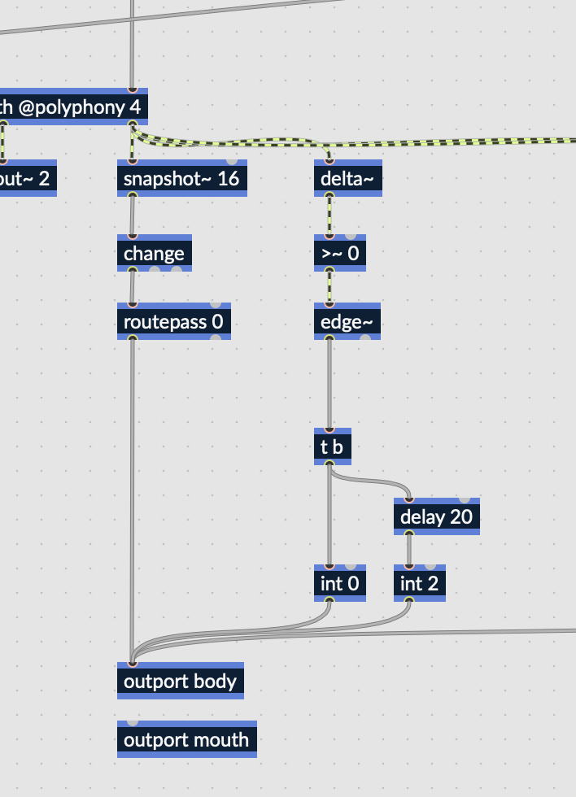

# rnbo-rpi-interface

This example is going to be a little bit different. The idea is to try to 
control the motors connected to this Raspberry Pi, but with a synthesizer.

## Directions

1. You'll see at the start of the workshop that something more complex is
currently running on the Raspberry Pi, but we'll do something simpler in this
workshop.
2. Let's start with the RNBO intro synth again.
3. We're going to modify this slightly. Specifically, we're going to wrap the 
polyphonic parent patcher in a monophonic parent. We're doing this so that the
parent patcher can have a single `outport` that will express the state of the
polyphonic child patch. 
4. Using the same trick as before, turn the envelopes of the polyphonic voices
into a boolean signal, in order to create a single number that expresses how
many voices are active.
5. Now, use some slightly fancy logic to make sure that the head lifts up
whenever you press a new note.

The basic idea is, whenever the voice count goes to zero, make the head go
back down. Otherwise, make it go down, then very quickly back up, whenever
a new voice becomes active.

6. With our runner program running on the pi, we can actually use `udpsend`
to test. 
7. With all that ready, we can do the final steps to run our code on the Raspberry Pi.
I'm going to add the Node script to the Raspberry Pi's crontab, so it will 
start on its own when we restart the raspberry pi.
8. You'll see me add some somewhat dumb code to the Raspberry Pi to wait 
10 seconds before sending a message to `/rnbo/listeners/add`. I've tried
doing this in a better, smarter way, but for now this is what works.
8. Moment of truth, we upload our RNBO patch to the Pi and restart it.
9. It works! (or not)